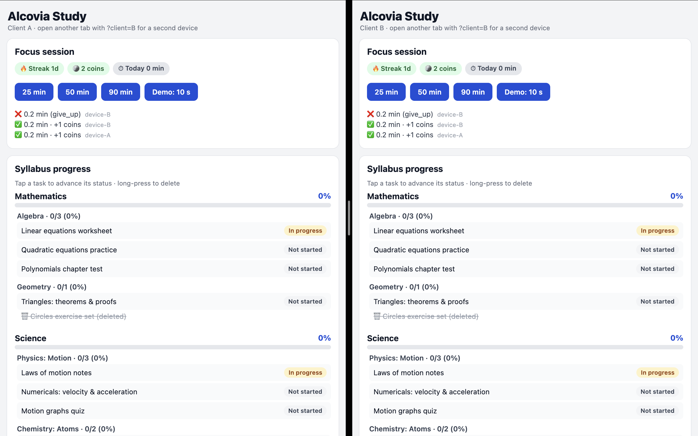

# Alcovia — Offline-First Focus & Syllabus Sync

Take-home for the Full Stack Engineering Intern role. Two features — **focus
sessions** and **syllabus progress** — built offline-first, with a backend that
keeps multiple devices in sync (own sync/merge logic, no off-the-shelf sync
product) and an n8n automation that notifies on successful sessions **exactly
once**.

See **[DECISIONS.md](DECISIONS.md)** for the sync model, conflict resolution and
idempotency reasoning.

## Demo

**[▶ Full demo video with audio](docs/demo-video.mp4)** — offline focus rewards with event sync.

Two clients staying in sync (tasks, coins, conflict handling):



```
shared/   the sync core: event types, hybrid logical clock, reducer (used by BOTH app & server)
server/   Express backend: event log + /sync protocol + n8n trigger + mock notification sink
app/      Expo (React Native) client: focus timer, syllabus, dev panel, offline sync engine
n8n-workflow.json   the automation, exported, importable into a fresh n8n
```

## How to run

Prereqs: Node 20+ (tested on 22), npm.

### 1. Backend

```bash
cd server
npm install
npm run dev          # http://localhost:4000, state persisted to server/data/db.json
```

### 2. App (web, two "devices")

```bash
cd app
npm install
npm run web          # opens http://localhost:8081
```

Open **two browser tabs**:

- `http://localhost:8081/?client=A`
- `http://localhost:8081/?client=B`

Each `client` value gets its own storage namespace, so the tabs behave like two
real devices on one account (hardcoded `student-1`). For an actual phone, run
`npx expo start` and open in Expo Go with
`EXPO_PUBLIC_SERVER_URL=http://<your-lan-ip>:4000` set.

### 3. n8n

```bash
npx n8n              # http://localhost:5678
```

In the n8n UI: **Workflows → Import from File → `n8n-workflow.json`**, open it,
then **Activate** the workflow (important: the idempotency guard uses workflow
static data, which only persists for active workflows — "Test workflow" runs
start with fresh static data). Optionally also import
`n8n-workflow-reward-prototype.json` (the "n8n-first" variant, see below).

The backend posts to `http://localhost:5678/webhook/focus-session-success`
(override with `N8N_WEBHOOK_URL`). The workflow delivers the notification to the
backend's **mock sink** (`POST /notification-sink`) — a stand-in for WhatsApp,
as the brief allows — and the app's dev panel displays the sink live. If your
n8n runs in Docker, change the sink URL in the HTTP Request node to
`http://host.docker.internal:4000/notification-sink`.

### Tests (including the convergence fuzz test)

```bash
cd server
npm test             # reducer/HLC unit tests + randomized multi-device convergence + exactly-once webhook
npm run typecheck
```

## The demo script (what the video shows)

1. Tab A and Tab B open, both online, dev panels visible.
2. Toggle **both offline** in the dev panels.
3. On **A**: run a focus session ("Demo: 10 s") to success → streak/coins update
   instantly, offline. On **B**: run one too, and **give up** a second one.
4. Conflicting edit: on A set *Linear equations worksheet* → **Done**; on B set
   the same task → **In progress**. (Also: delete a task on A that B edits.)
5. Outboxes show queued events. Toggle **A online** → it syncs; toggle **B
   online** → both converge to the identical state (compare "Show local state").
6. The dev panel's notification sink shows **one entry per successful session**
   — even though each session's completion event was replayed and pulled by the
   other device, and the same task edits arrived from both sides.
7. The losing device shows a **"Merged while you were offline"** banner
   explaining what its edit lost to.
8. Two-way loop: in either dev panel press **"Reply: snooze 10 m"** (simulating
   a WhatsApp reply). The reply hits the n8n webhook → backend → becomes a
   synced event → a snooze banner appears on **both** devices. Press the same
   reply twice — `replyId` dedupe means state changes once.
9. Kill and restart the server (`npm run dev`) — state survives, nothing
   re-fires.

## What the core handles

- **Offline-first**: every action applies instantly to local state and a durable
  outbox (AsyncStorage / localStorage); the network is never on the critical
  path. Restart mid-queue and the outbox survives.
- **Two devices converge**: identical state on both after reconnect — see
  DECISIONS.md for why, and `server/test/convergence.test.ts` for the proof.
- **Idempotent rewards**: coins/streak/today-total are derived from the set of
  completed sessions, so replays and double-device arrivals can't double-count.
- **Idempotent automation**: backend fires once per session ever (persisted
  claim), n8n dedupes again on `sessionId` in case a crash forces a redelivery.
- **Conflicts, deliberately**: HLC last-writer-wins for status edits
  (clock-skew-proof), delete-wins for edit-vs-delete (shown as a tombstone, not
  silently), eventId dedupe + terminal-beats-running for replayed/out-of-order
  messages.
- **Demonstrable**: per-client dev panel with online/offline toggle, force sync,
  outbox/cursor inspection, full state dump, and live notification-sink view.

## Choices the brief left open (noted as required)

- **Grace period**: 5 s hidden/backgrounded → session fails (`app_switch`).
- **Restart mid-session**: counts as `app_switch` failure (the student left the
  app; allowing resume would make backgrounding undetectable on web).
- **Coins**: 1 coin per target minute (50-min session = +50), min 1.
- **Streak**: consecutive calendar days with ≥1 successful session, counted back
  from today; a day with no success *yet* doesn't break yesterday's streak.
- **Schema/copy**: hardcoded seed syllabus (2 subjects × 2 chapters × 2–3
  tasks); statuses cycle Not started → In progress → Done on tap; long-press
  deletes.
- **Notification target**: mock sink endpoint (allowed by the brief); swapping
  the HTTP Request node for a WhatsApp provider node changes nothing about the
  idempotency story.

## Beyond core (from the optional list)

- **Two-way loop**: the dev panel simulates a WhatsApp reply ("done" /
  "snooze 10 m") → n8n's `notification-reply` webhook → backend turns it into a
  **server-authored event** in the same log (the server keeps its own HLC) → it
  reconciles to every device like any other edit. Replies carry a `replyId`, so
  a replayed reply mutates state exactly once (covered by a test).
- **n8n-first, then migrate**: `n8n-workflow-reward-prototype.json` implements
  the streak/coins rule *inside an n8n Code node* from raw facts; start the
  server with `REWARD_RULE_IN_N8N=1` to route through it. The default path is
  the same rule migrated into the shared reducer. Tradeoff discussion in
  DECISIONS.md.
- **Surfaces conflicts to the user**: when a pulled remote edit beats a write
  made on *this* device (or deletes a task this device edited), the app shows a
  "Merged while you were offline" banner saying exactly what happened, instead
  of changing data silently.
- **Property/fuzz test**: randomized offline edit sequences across **3 devices**
  with skewed clocks and replayed deliveries always converge (30 seeded runs).
- **Works with 3+ devices**: nothing in the protocol is two-device-specific
  (the fuzz test runs three; on web, any `?client=X` is another device).
- **Survives app restart / crash mid-session**: state + outbox persist; an
  interrupted focus session is detected and failed on next boot.
- **Resumes safely mid-sync**: the cursor only advances after a successful
  apply+persist; a dropped response just means the next round re-pulls
  (idempotently).
- **Efficient sync**: devices exchange only deltas — the outbox (new local
  events) goes up, only events after the device's cursor come down. Full state
  never crosses the wire (a brand-new device replaying history is the
  bootstrapping exception; compaction is the known fix, see DECISIONS.md).
- **CI**: GitHub Actions runs typechecks and the full test suite on every push.

Still on the table: running on a real phone via Expo Go (supported via
`EXPO_PUBLIC_SERVER_URL`, demoed best live).

## What I left out / would do next

- **Log compaction / snapshotting** so new devices don't replay full history
  (the tradeoff discussed in DECISIONS.md).
- **Per-user timezone** for day boundaries; currently device-local.
- **SQLite on device** instead of a single AsyncStorage document; transactional
  appends.
- **Richer reply actions** (e.g. "done" marking a chosen task complete) — the
  reply→event pipeline is in place; it's a mapping decision, not a sync problem.
- Auth, multiple students, real WhatsApp delivery (swap the sink HTTP node for
  a provider node; the idempotency story is unchanged).
